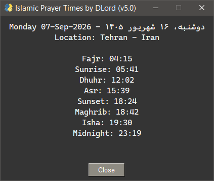

  

## Islamic-Prayer-Times_GUI   
  اوقات شرعی
### [**_Islamic-Prayer-Times_**](https://github.com/DLord420/Islamic-Prayer-Times) GUI port    
#### Islamic prayer and related times, ~~and weather condition~~.   
A simple Python GUI app to show today's Islamic prayer and related times for a given location.   
* Using: http://api.aladhan.com/
* Calculation method: Institute of Geophysics, University of Tehran   
* Midnight mode: Jafari    
   
-----   
Weather data acquired using https://wttr.in/   (*usage dropped in v5+)   
Many thanks to sepandhaghighi for the [**_ASCII Art Library for Python_**](https://github.com/sepandhaghighi/art)   (*usage dropped in v5+)   
GUI built using [**_FreeSimpleGUI_**](https://github.com/spyoungtech/FreeSimpleGUI)   
Binary was built using [**_Auto PY to EXE_**](https://github.com/brentvollebregt/auto-py-to-exe)
